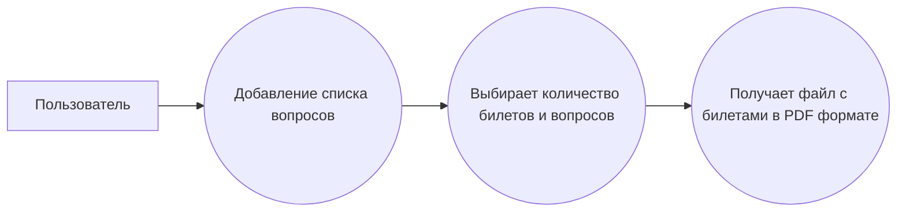
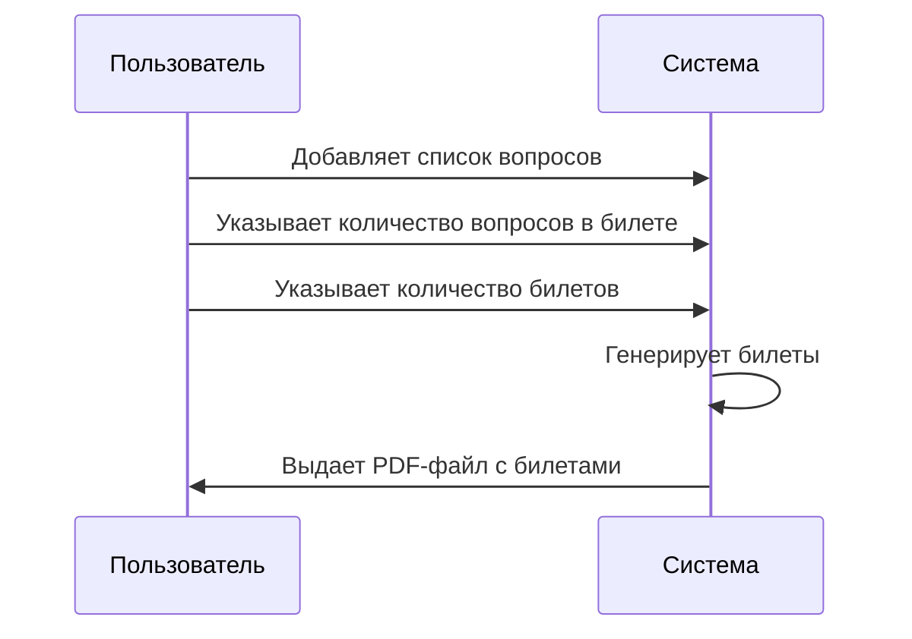
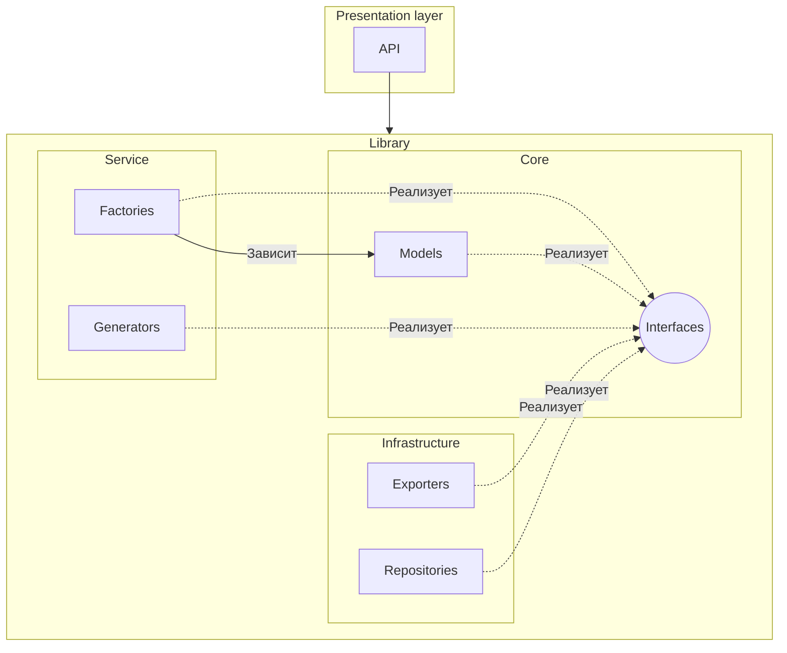

# Диаграммы

## Прецедентов



## Последовательности



## Компонентов



## Регламент

- ;
- ;
- .

## Цель проекта: Разработка генератора экзаменационных билетов.

Ключевые функции:

- Хранение вопросов и билетов в JSON-файле.
- Генерация билетов по запросу пользователя (количество вопросов варьируется с количеством билетов).
- Экспорт в PDF (используя библиотеку QuestPDF)

## Контракты базовых сущностей

```cs
namespace ExamPaper.Core.Interfaces
{
    public interface IQuestion
    {

        Guid Id { get; }
        string Text { get; }
    }
}
```

```cs
using System;
using System.Collections.Generic;

namespace ExamPaper.Core.Interfaces
{

    public interface IExamPaper
    {

        Guid Id { get; }
        string Title { get; }
        IReadOnlyCollection<IQuestion> Questions { get; }

    }
}
```

## SAST Tools

[PVS-Studio](https://pvs-studio.com/pvs-studio/?utm_source=website&utm_medium=github&utm_campaign=open_source) - static
analyzer for C, C++, C#, and Java code.
